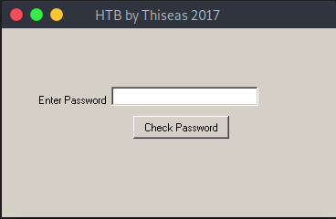
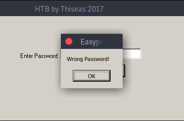
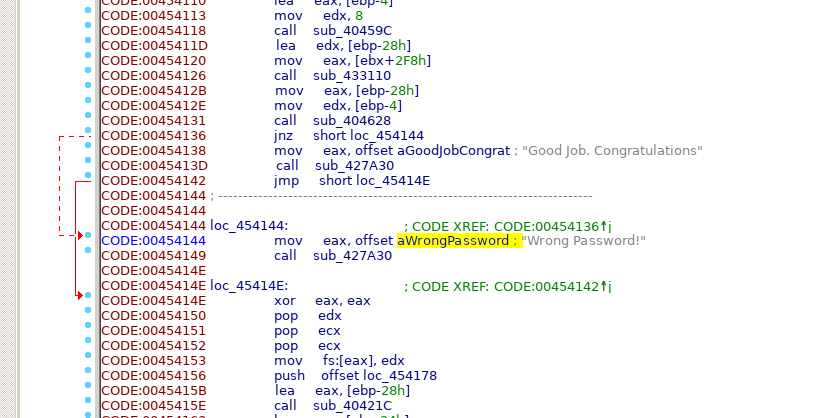
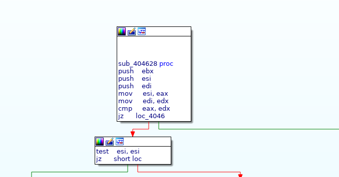
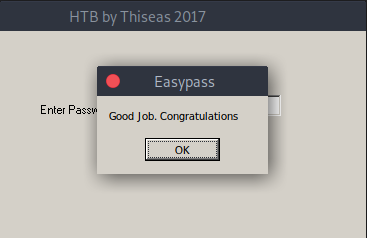

# Beginner Track - Find The Easy pass

Description:

Find the password (say PASS) and enter the flag in the form HTB{PASS}

The first step is to download the zip and unzip it (password: hackthebox). It reveals an executeable called `EasyPass.exe`. To run it you either use a Windows system or use Wine in Linux. 

If we enter a password like `test` and press the `Check Password` button, we are notified that our password is wrong.

Now that we got some information, we can open a debugger/disassembler to analyze the code. You got several options for that (IDA, Immunity, Ollydbg, Ghidra). Choose the one that you like most. I chose IDA for this task.

If you open the executable with IDA you should see something like this:

As we already know that we are prompted with a "Wrong password" message, once we enter a wrong password, we can search for this specifc string.

If you are familiar with Assembly, then you should directly see what's happening. Let's take a look at the graph, so that everybody sees it.

So what's happening is following:

`CALL sub_404628` (the second line from the bottom in the upper rectangle), calls a function `sub_404628`. We currently don't know what this functions does, but the outcome of it decides whether we get a "Congratulations! Good Job" message or the "Wrong Password" one (`jnz` = Jump if not zero to the "Wrong Password" part, else continue to "Good Job").

Let's take a look at the function.

It's basically just comparing two values (EAX and EDX). Depending on their equality, we get a zero flag or not.

Let's set a breakpoint at the `CALL sub_404628` of the "main graph" and run the program. We can then investigate which values are in those two registers. (Shortcuts: F2 = breakpoint, F9 = start the program)

Once reaching that breakpoint (I entered the password `test`), we can take a look at the General Registers, especially RAX and RDX.

Let's print the content of those registers (you can also simply hover over the registers to see the values)

Our input `test` is compared to `fortran!`. Based on this comparison, we receive either the `Good Job` or `Wrong Password` message. So `fortran!` must be the correct password then.

To verify this, we can start the program again and insert `fortran!` as the password.

There we go, we got the correct password!