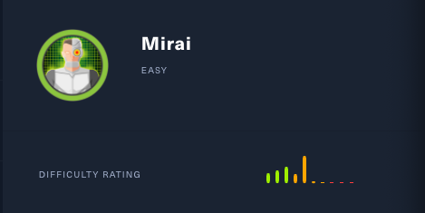
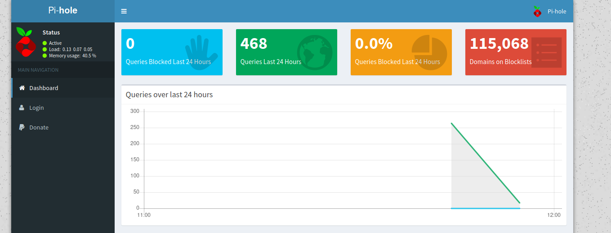

# Mirai (Linux)

## Enumeration

```
rustscan --ulimit 5000 10.129.82.32 -- -sV -o port_scan

PORT      STATE SERVICE REASON  VERSION
22/tcp    open  ssh     syn-ack OpenSSH 6.7p1 Debian 5+deb8u3 (protocol 2.0)
53/tcp    open  domain  syn-ack dnsmasq 2.76
80/tcp    open  http    syn-ack lighttpd 1.4.35
1879/tcp  open  upnp    syn-ack Platinum UPnP 1.0.5.13 (UPnP/1.0 DLNADOC/1.50)
32400/tcp open  http    syn-ack Plex Media Server httpd
32469/tcp open  upnp    syn-ack Platinum UPnP 1.0.5.13 (UPnP/1.0 DLNADOC/1.50)
Service Info: OS: Linux; CPE: cpe:/o:linux:linux_kernel
```

### Examine Port 80 - lighttpd Server

Accessing port 80 via the browser, leaves us with an empty page. Using gobuster we discover an interesting directory as well as a javascript file.

```
└──╼ $ gobuster dir -u "10.129.82.32" -w /usr/share/wordlists/dirb/common.txt  
===============================================================
Gobuster v3.0.1
by OJ Reeves (@TheColonial) & Christian Mehlmauer (@_FireFart_)
===============================================================
[+] Url:            http://10.129.82.32
[+] Threads:        10
[+] Wordlist:       /usr/share/wordlists/dirb/common.txt
[+] Status codes:   200,204,301,302,307,401,403
[+] User Agent:     gobuster/3.0.1
[+] Timeout:        10s
===============================================================
2021/01/19 12:48:53 Starting gobuster
===============================================================
/admin (Status: 301)
/swfobject.js (Status: 200)
===============================================================
2021/01/19 12:49:18 Finished
===============================================================
```

Taking a look at the admin directory (via the browser), we see the default config page for Pi-hole.



Pi-hole is a Linux network-level advertisement and Internet tracker blocking application which acts as a DNS sinkhole and optionally a DHCP server, intended for use on a private network.

## Gaining an Initial Foothold

As Pi-holes are usually installed on a Raspberry Pi, I tried to login as the default user via ssh (pi:raspberry). And it worked!

```
pi@raspberrypi:~ $ id
uid=1000(pi) gid=1000(pi) groups=1000(pi),4(adm),20(dialout),24(cdrom),27(sudo),29(audio),44(video),46(plugdev),60(games),100(users),101(input),108(netdev),117(i2c),998(gpio),999(spi)
```

## Privilege Escalation

We also see that pi is in the sudo group.

```
pi@raspberrypi:~ $ sudo -l
Matching Defaults entries for pi on localhost:
    env_reset, mail_badpass, secure_path=/usr/local/sbin\:/usr/local/bin\:/usr/sbin\:/usr/bin\:/sbin\:/bin

User pi may run the following commands on localhost:
    (ALL : ALL) ALL
    (ALL) NOPASSWD: ALL
```

So gaining a root shell is also very easy:

```
pi@raspberrypi:~ $ su -
Password: raspberry

SSH is enabled and the default password for the 'pi' user has not been changed.
This is a security risk - please login as the 'pi' user and type 'passwd' to set a new password.


SSH is enabled and the default password for the 'pi' user has not been changed.
This is a security risk - please login as the 'pi' user and type 'passwd' to set a new password.

root@raspberrypi:~# id
uid=0(root) gid=0(root) groups=0(root)
```

So basically we have pwned the machine. Atleast that's what I thought. When trying to read the root flag it states:

```
root@raspberrypi:~# cat /root/root.txt
I lost my original root.txt! I think I may have a backup on my USB stick...
```

Hm ok... Let's inspect the various filesystems on the machine to see if we can find something interesting:

```
root@raspberrypi:~# df -h
Filesystem      Size  Used Avail Use% Mounted on
aufs            8.5G  2.8G  5.3G  34% /
tmpfs           100M  4.8M   96M   5% /run
/dev/sda1       1.3G  1.3G     0 100% /lib/live/mount/persistence/sda1
/dev/loop0      1.3G  1.3G     0 100% /lib/live/mount/rootfs/filesystem.squashfs
tmpfs           250M     0  250M   0% /lib/live/mount/overlay
/dev/sda2       8.5G  2.8G  5.3G  34% /lib/live/mount/persistence/sda2
devtmpfs         10M     0   10M   0% /dev
tmpfs           250M  8.0K  250M   1% /dev/shm
tmpfs           5.0M  4.0K  5.0M   1% /run/lock
tmpfs           250M     0  250M   0% /sys/fs/cgroup
tmpfs           250M  8.0K  250M   1% /tmp
/dev/sdb        8.7M   93K  7.9M   2% /me
```

We see the filesystem /dev/sdb which has been mounted on /media/usbstick. A USBSTICK! That's what we are looking for.

```
root@raspberrypi:/media/usbstick# ls
damnit.txt  lost+found
root@raspberrypi:/media/usbstick# cat damnit.txt 
Damnit! Sorry man I accidentally deleted your files off the USB stick.
Do you know if there is any way to get them back?

-James
```

Hmm... So what now? Maybe we are lucky and the files are deleted but not yet overwritten. A further assumption is, that the flag is a human readable string as in the other challenges. If so, we can try to run `strings` on `/dev/sdb` to see if the flag is still in memory.

```
root@raspberrypi:~# strings /dev/sdb
>r &
/media/usbstick
lost+found
root.txt
damnit.txt
>r &
>r &
/media/usbstick
lost+found
root.txt
damnit.txt
>r &
/media/usbstick
2]8^
lost+found
root.txt
damnit.txt
>r &
3d3e483143ff12ec505d026fa13e020b
Damnit! Sorry man I accidentally deleted your files off the USB stick.
Do you know if there is any way to get them back?
-James
```

There it is! A suspicious string that looks like a flag. Let's try to submit it ... And it works! Machine pwned!


